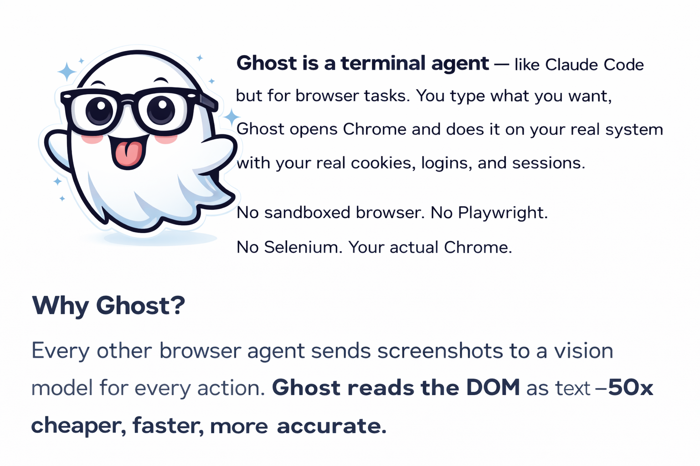

<p align="center">
  
</p>

<h1 align="center">Ghost</h1>

<p align="center">
  <strong>AI browser agent that saves you time and money.</strong><br>
  Type a task. Ghost does it.
</p>

<p align="center">
  <a href="https://pypi.org/project/ghostagent/"></a>
  <a href="https://github.com/rohitmenonhart-xhunter/Ghost/stargazers"></a>
  <a href="https://github.com/rohitmenonhart-xhunter/Ghost/blob/main/LICENSE"></a>
</p>

---

## Get Started

```bash
pip install ghostagent
ghost
```

Ghost walks you through setup on first run — enter your API key once, grant permissions, done.

```
╔══════════════════════════════════════════╗
║  👻 Ghost v0.3.0                         ║
║  AI browser agent. DOM + OCR + Memory.   ║
╚══════════════════════════════════════════╝

  First-time Setup
  Enter your OpenRouter API key: sk-or-v1-xxxxx
  ✓ API key saved. You won't need to enter this again.

  Grant all permissions? [y/n]: y
  ✓ Ghost is ready.
  Model: anthropic/claude-sonnet-4

  ghost> _
```

---

## Why Ghost?



Every other browser agent sends **screenshots to a vision model** for every action. Ghost reads the **DOM as text** — same information, **50x cheaper, faster, more accurate.**


---

## See It In Action

```
ghost> Sign into Upwork with Google using rohit@gmail.com
  Step 1: NAVIGATE upwork.com/login
  Step 2: CLICK "Continue with Google"
  Step 3: CLICK "rohit@gmail.com"
  ╭──── ✓ Done ────╮
  │ Signed in.      │
  ╰─────────────────╯

ghost> Get the top 5 trending repos on GitHub with star counts
  ╭──── ✓ Done ────────────────────────────────────────╮
  │ • bytedance/deer-flow — 49,092 ⭐                   │
  │ • ruvnet/RuView — 43,386 ⭐                         │
  │ • agentscope-ai/agentscope — 20,727 ⭐              │
  │ • virattt/dexter — 19,147 ⭐                        │
  │ • Yeachan-Heo/oh-my-claudecode — 13,001 ⭐          │
  ╰─────────────────────────────────────────────────────╯

ghost> Convert ~/Downloads/report.pdf to DOCX
  Step 1: NAVIGATE cloudconvert.com
  Step 2: CLICK "Select File"
  [DIALOG] File picker → Downloads → report.pdf → Open
  Step 3: CLICK "Convert"  →  Step 4: CLICK "Download"
  ╭──── ✓ Done ──────────────────────╮
  │ Saved report.docx to Downloads.   │
  ╰───────────────────────────────────╯
```

---

## How It Works


Three perception layers — cheapest first, smartest always:


DOM handles 90% of actions. VLM is the last resort, not the first.


---

## Commands

| Command | What it does |
|---------|-------------|
| `ghost` | Start Ghost |
| `/loop [task]` | Repeat continuously, Ctrl+C to stop + summary |
| `/model [name]` | Switch LLM (saved across sessions) |
| `/config` | View/edit API key and settings |
| `/memory` | What Ghost remembers |
| `/tasks` | Completed tasks |
| `/tabs` | Open browser tabs |
| `/help` | All commands |
| `/quit` | Exit |
| **[anything else]** | **Ghost does it** |

---

## Loop Mode

Run a task on repeat. Ghost finds new items each iteration. Ctrl+C for summary.

```
ghost> /loop Search Upwork for Python jobs and apply to matching ones

  🔄 Loop Mode — Press Ctrl+C to stop

  ── Iteration 1 ──
  ✓ Applied to "Django REST API developer" ($50-80/hr)

  ── Iteration 2 ──
  ✓ Applied to "FastAPI microservice project" ($40-60/hr)

  ^C

  ╭──── 🔄 Loop Summary ─────────────────────╮
  │ • Applied to 2 jobs in 3 minutes          │
  │ • Django REST API ($50-80/hr)             │
  │ • FastAPI microservice ($40-60/hr)        │
  ╰───────────────────────────────────────────╯
  Summary saved to ~/ghost_loop_summary.md
```

---

## Any LLM. Your Choice.

```
ghost> /model anthropic/claude-sonnet-4-6     # recommended
ghost> /model openai/gpt-4.6                  # OpenAI latest
ghost> /model google/gemini-3.1-pro           # Google latest
ghost> /model google/gemini-2.5-flash         # cheapest
ghost> /model meta-llama/llama-4-maverick     # open source
```

---

## Memory & Task Replay

Ghost learns. First run costs $0.003. Repeat runs cost **$0.000**.

```
ghost> /memory
┌─────────────────────────────────────────┐
│ - Upwork login uses Google OAuth        │
│ - GitHub trending is at /trending       │
│ - CloudConvert is best for PDF→DOCX     │
└─────────────────────────────────────────┘
```

---

## Benchmarks


| Agent | Approach | Cost/task | Accuracy | Memory |
|-------|----------|-----------|----------|--------|
| Claude Computer Use | Screenshots → VLM | $0.10-5.00 | ~85% | No |
| OpenAI Operator | Screenshots → VLM | $0.10-5.00 | ~85% | No |
| Browser Use | Playwright + LLM | $0.01-0.05 | ~89% | No |
| **Ghost** | **DOM + OCR + text LLM** | **$0.003** | **~99%** | **Yes** |

---

## Settings

```
ghost> /config
  API Key     sk-or-v1...fc283
  Model       anthropic/claude-sonnet-4
  Config      ~/.ghost/config.json

ghost> /config key sk-or-v1-new-key
ghost> /config model openai/gpt-4o
```

---

## Setup (Fresh Mac)

```bash
pip install ghostagent
ghost
# System Settings → Privacy & Security → Accessibility → Add terminal app → ON
```

Three steps. Ghost handles everything else.

---

<p align="center">
  
</p>

<h2 align="center">Introducing Silver Browser</h2>

<p align="center">
  <em>The browser built for AI. Open source. Coming soon.</em>
</p>

Ghost is powerful — but it's controlling someone else's browser. **What if the browser itself was built for AI from the ground up?**

**Silver** is our open-source browser that ships with Ghost built in.The AI agent is part of the browser, not bolted on top.

### What makes Silver different

- **Ghost agent built-in** — talk to your browser, it does things
- **Proprietary browser control model** — our own SOTA model for browser understanding, trained specifically for element grounding, page comprehension, and action planning
- **Local inference** — run the model on your machine. Your data never leaves your device
- **Cloud inference** — need speed? Use our cloud API. Same model, faster execution
- **Privacy-first** — no telemetry, no screen recordings sent to third parties, no data collection
- **Open source** — the browser is open. The model weights will be available for local use

### The model

We're building a **purpose-built browser control model** — not a general VLM repurposed for clicking buttons. Trained on millions of real browser interactions, optimized for:

- **Element grounding**: given a task, find the exact element to interact with
- **Page understanding**: know what a page is about from its structure, not pixels
- **Action planning**: decompose multi-step tasks into reliable action sequences
- **Cross-site generalization**: works on any website, not just ones it was trained on

This will be **state-of-the-art for browser control** — benchmarked against Claude Computer Use, OpenAI Operator, and Browser Use. With privacy.

### Why a new browser?

Chrome, Firefox, Safari — they were built for humans. Silver is built for **humans + AI working together**. The AI doesn't fight the browser. It *is* the browser.

> **Time to shift to a browser that's built in front of you. Exceptional performance. SOTA AI engine. Intelligence unbound.**

---

<p align="center">
  <strong>Silver Browser + Ghost Agent</strong><br>
  <em>Coming from <a href="https://hitroo.com">Hitroo Labs</a></em>
</p>

---

## Architecture

```
ghost/
├── cli.py                 # Terminal agent (the ghost command)
├── config.py              # Persistent settings
├── browser/
│   ├── cdp.py             # Chrome DevTools Protocol
│   ├── agent.py           # AI + DOM automation
│   └── tabs.py            # Multi-tab management
├── vision/
│   ├── ocr.py             # RapidOCR
│   ├── perceive.py        # DOM + OCR + VLM fusion
│   └── vlm.py             # Vision LLM fallback
├── agent/
│   ├── apps.py            # App management
│   ├── file_dialog.py     # File picker handling
│   ├── clipboard.py       # Copy/paste
│   ├── safety.py          # Safety rails
│   └── recovery.py        # Error recovery
└── memory/
    ├── memory.py           # Persistent memory
    └── replay.py           # Task replay
```

## Install from Source

```bash
git clone https://github.com/rohitmenonhart-xhunter/Ghost.git
cd Ghost
pip install -e .
ghost
```

## License

Apache 2.0

## Contributing

PRs welcome. Ghost is open source and built for the community.

---

<p align="center">
  Built by <a href="https://github.com/rohitmenonhart-xhunter"><strong>Hitroo Labs</strong></a>
</p>
