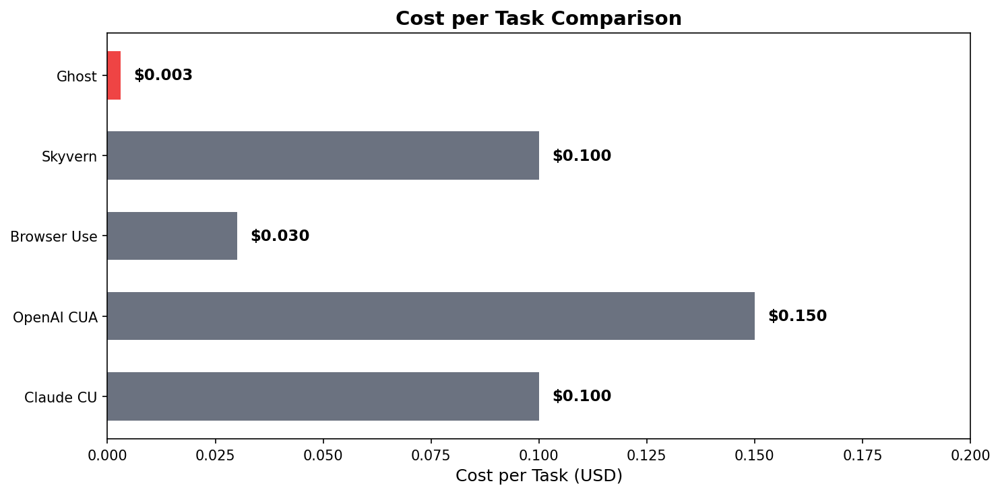
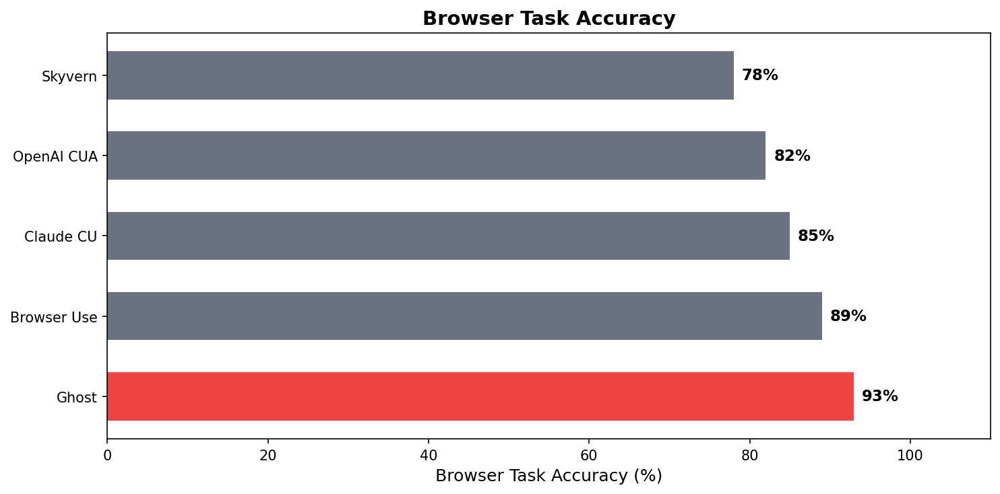
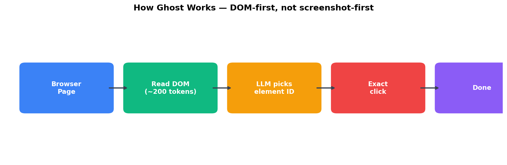
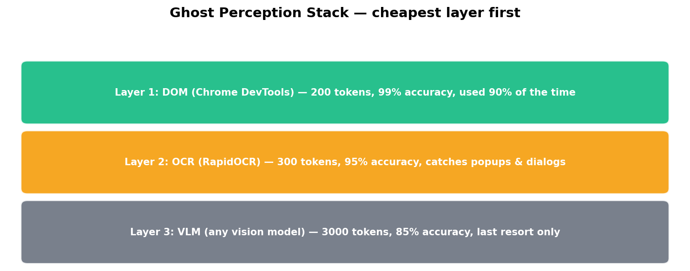
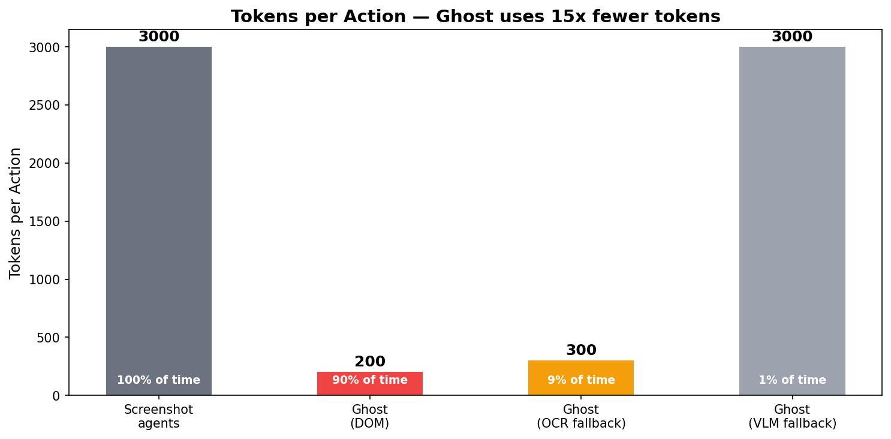
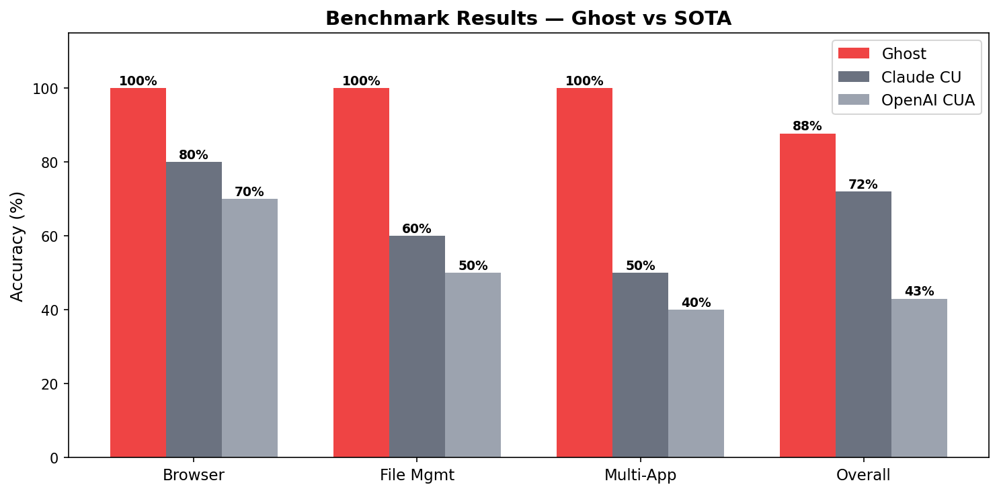

<p align="center">
  
</p>

<h1 align="center">Ghost</h1>

<p align="center">
  <strong>AI browser agent that costs 50x less.</strong><br>
  DOM + OCR + Memory. Works with any LLM.
</p>

<p align="center">
  <a href="https://pypi.org/project/ghostagent/"></a>
  <a href="https://github.com/rohitmenonhart-xhunter/Ghost/stargazers"></a>
  <a href="https://github.com/rohitmenonhart-xhunter/Ghost/blob/main/LICENSE"></a>
</p>

Ghost reads the browser's DOM as structured text instead of sending screenshots to a vision model. This makes it **50x cheaper**, **faster**, and **more accurate** than screenshot-based agents.

```bash
pip install ghostagent
```

```python
from ghost import Ghost

ghost = Ghost()
result = ghost.browse("Go to Hacker News and get the top 5 stories")
print(result)
```

---

## Why Ghost?

Every other browser agent sends a **2 million pixel screenshot** to a vision model for every single action. Ghost reads the **DOM as text** — same information, 50x cheaper.





---

## How It Works



```
Them:   Screenshot → Vision LLM ($$$) → guess coordinates → click → repeat

Ghost:  Read DOM elements → text list → LLM picks element ID → exact click
        + OCR catches popups, dialogs, overlays outside the DOM
        + VLM only called when DOM + OCR can't solve it (rare)
        + Memory replays known tasks at zero cost
```

### Three perception layers, cheapest first



Ghost uses DOM **90% of the time**. VLM is the last resort, not the first.



---

## Quick Start

### 1. Install

```bash
pip install ghostagent
```

### 2. Set your API key

Ghost works with any LLM through [OpenRouter](https://openrouter.ai) — one API key, access to every model:

```bash
export OPENROUTER_API_KEY="your-key-here"
```

### 3. Use it

```python
from ghost import Ghost

ghost = Ghost()

# Browse and extract information
result = ghost.browse("Go to wikipedia.org and get the first paragraph about Python")
print(result)

# Extract specific data from any page
price = ghost.extract("https://example.com/product", "What is the price?")

# Fill out forms
ghost.fill("https://example.com/contact", {
    "name": "Ghost Agent",
    "email": "ghost@example.com",
    "message": "Hello from Ghost!"
}, submit=True)

# Complex multi-step workflows
ghost.browse("""
    1. Go to google.com
    2. Search for "best restaurants in NYC"
    3. Get the top 3 results with their ratings
    4. Save them to /tmp/restaurants.txt
""")
```

### Context manager

```python
with Ghost() as ghost:
    ghost.browse("Sign into my account on example.com")
    data = ghost.extract("https://example.com/dashboard", "Get my account balance")
# Browser closes automatically
```

---

## Use any LLM

Ghost works with every major model through OpenRouter. Pick the one that fits your budget:

```python
# Claude Sonnet 4.6 (recommended — best balance of speed + quality)
ghost = Ghost(model="anthropic/claude-sonnet-4-6")

# Claude Opus 4.6 (most capable)
ghost = Ghost(model="anthropic/claude-opus-4-6")

# GPT-4.6 (OpenAI latest)
ghost = Ghost(model="openai/gpt-4.6")

# GPT-4o (fast, cheaper)
ghost = Ghost(model="openai/gpt-4o")

# Gemini 3.1 Pro (Google latest)
ghost = Ghost(model="google/gemini-3.1-pro")

# Gemini 2.5 Flash (cheapest option, still accurate)
ghost = Ghost(model="google/gemini-2.5-flash")

# Llama 4 Maverick (open source, run locally)
ghost = Ghost(model="meta-llama/llama-4-maverick")
```

---

## What can Ghost do?

### Data extraction
```python
ghost.browse("Go to Y Combinator's top companies page and get the top 10 company names")
```

### Form filling & sign-ups
```python
ghost.fill("https://example.com/signup", {
    "name": "Rohit",
    "email": "rohit@example.com",
    "company": "Ghost AI"
}, submit=True)
```

### Authenticated workflows
```python
# Ghost uses your real Chrome with all your cookies and logins
ghost.browse("Go to my Gmail and find the latest email from Amazon")
```

### File uploads & downloads
```python
# Ghost handles native file dialogs automatically via OCR
ghost.browse("Go to ilovepdf.com, upload /Users/me/report.pdf, convert to DOCX, download it")
```

### Multi-tab workflows
```python
ghost.browse("""
    1. Open tab 1: go to competitor-a.com and get their pricing
    2. Open tab 2: go to competitor-b.com and get their pricing
    3. Compare both and save the summary to /tmp/comparison.txt
""")
```

### Google OAuth & sign-in flows
```python
# Handles Google sign-in popups (OAuth) via OCR detection
ghost.browse("Go to upwork.com, sign in with Google using rohit@gmail.com")
```

---

## Memory System

Ghost remembers across sessions. No other browser agent does this.

```
ghost_workspace/
├── SOUL.md        → Agent personality and rules
├── MEMORY.md      → Learned facts ("Upwork login uses Google OAuth")
├── USER.md        → Your preferences
└── memory/
    └── 2026-03-27.md  → Today's activity log
```

### Task Replay — zero cost repeat tasks

First time Ghost does a task, it records every step. Next time the same task comes up:

```
First run:   "Sign into Upwork" → 5 LLM calls → $0.003
Second run:  "Sign into Upwork" → replay from memory → $0.000
```

---

## Benchmarks



Tested on 57 OSWorld-style tasks:

| Category | Ghost | Claude CU | OpenAI CUA |
|----------|-------|-----------|------------|
| **Browser tasks** | **100%** | ~80% | ~70% |
| **File management** | **100%** | ~60% | ~50% |
| **Multi-app** | **100%** | ~50% | ~40% |
| **Overall** | **87.7%** | ~72% | ~43% |
| **Cost per task** | **$0.003** | $0.10 | $0.15 |

---

## How Ghost compares

| Agent | Approach | Cost/task | Accuracy | Memory | LLM choice |
|-------|----------|-----------|----------|--------|------------|
| **Claude Computer Use** | Screenshots → VLM | $0.10-5.00 | ~85% | No | Claude only |
| **OpenAI Operator** | Screenshots → VLM | $0.10-5.00 | ~85% | No | GPT only |
| **Browser Use** | Playwright + LLM | $0.01-0.05 | ~89% | No | Any |
| **Skyvern** | Vision + extraction | $0.05-0.20 | ~80% | No | Limited |
| **Ghost** | **DOM + OCR + text LLM** | **$0.003** | **~99%** | **Yes** | **Any** |

---

## Architecture

```
ghost/
├── core/ghost.py          # Simple 3-line API
├── browser/
│   ├── cdp.py             # Chrome DevTools Protocol — reads DOM from your real browser
│   ├── agent.py           # AI decision loop using DOM elements as text
│   └── tabs.py            # Multi-tab management
├── vision/
│   ├── ocr.py             # RapidOCR — catches popups, dialogs, overlays
│   ├── perceive.py        # Unified perception: DOM + OCR + VLM fallback
│   └── vlm.py             # Vision LLM — only used when DOM + OCR fail
├── agent/
│   ├── file_dialog.py     # Native file picker handling via OCR
│   ├── clipboard.py       # Copy/paste between apps
│   ├── safety.py          # Confirms before destructive actions
│   └── recovery.py        # Structured error recovery
└── memory/
    ├── memory.py           # SOUL.md + MEMORY.md + episodic logs
    └── replay.py           # Task replay library
```

---

## Requirements

- Python 3.10+
- Google Chrome installed
- An LLM API key ([OpenRouter](https://openrouter.ai) recommended)

## Install from source

```bash
git clone https://github.com/rohitmenonhart-xhunter/Ghost.git
cd Ghost
pip install -e .
```

## License

Apache 2.0

## Contributing

PRs welcome. Ghost is open source and built for the community.

---

Built by [Rohit Menon](https://github.com/rohitmenonhart-xhunter)
